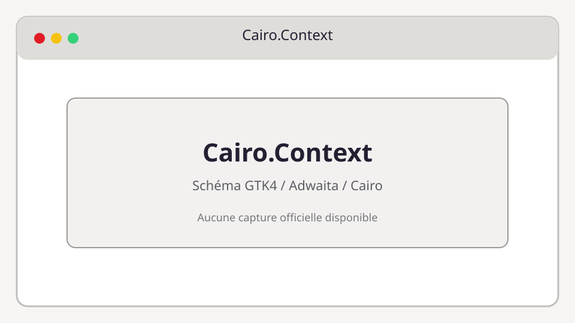

# Cairo.Context

**Bibliothèque :** Cairo  
**Import :** `import Cairo from 'gi:cairo-1.0'`



## Description

Contexte de dessin Cairo : chemins, sources, transformations et rendu.

Cairo est une API de dessin impérative. Dans GTK4, un `Cairo.Context` est généralement fourni par `Gtk.DrawingArea.setDrawFunc` et ne doit pas être conservé après le callback.

## Exemple TypeScript

```ts
import Cairo from 'gi:cairo-1.0'

const cr = new Cairo.Context(surface)
cr.setSourceRgb(0.2, 0.5, 0.9)
cr.rectangle(0, 0, 320, 180)
cr.fill()
```

## API principale

```ts
Cairo.Context.save(); restore(); translate(x: number, y: number); scale(x: number, y: number); rotate(angle: number); moveTo(x: number, y: number); lineTo(x: number, y: number); curveTo(...); rectangle(x: number, y: number, width: number, height: number); arc(...); fill(); stroke(); paint(); clip(); showText(text: string)
```

### Propriétés et types

- `operator`
- `lineWidth`
- `lineCap`
- `lineJoin`
- `miterLimit`
- `fillRule`
- `tolerance`

### Signaux

- Les types Cairo ne possèdent pas de signaux GObject.

## Utilisation avec GTK4

```ts
import Gtk from 'gi:Gtk-4.0'

const area = new Gtk.DrawingArea({ contentWidth: 320, contentHeight: 180 })
area.setDrawFunc((_area, cr, width, height) => {
  cr.setSourceRgb(0.1, 0.1, 0.1)
  cr.rectangle(0, 0, width, height)
  cr.fill()
})
```

## Références

- [Cairo manual](https://cairographics.org/manual/)
- [Guide API TypeScript](../typescript-gtk4-adwaita-cairo-api-examples.md)
