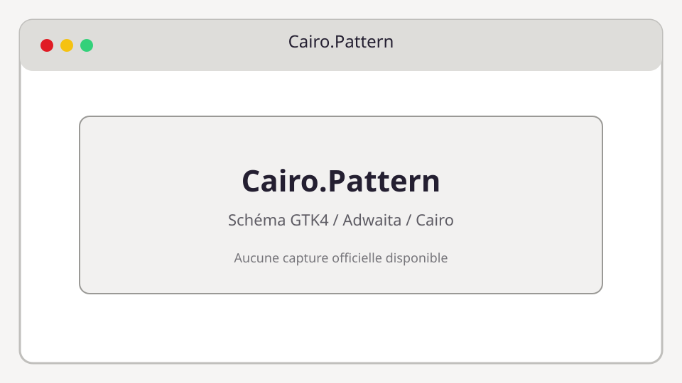

# Cairo.Pattern

**Bibliothèque :** Cairo  
**Import :** `import Cairo from 'gi:cairo-1.0'`



## Description

Source de peinture abstraite.

Cairo est une API de dessin impérative. Dans GTK4, un `Cairo.Context` est généralement fourni par `Gtk.DrawingArea.setDrawFunc` et ne doit pas être conservé après le callback.

## Exemple TypeScript

```ts
import Cairo from 'gi:cairo-1.0'

cr.setSource(pattern)
cr.paint()
```

## API principale

```ts
Cairo.Pattern.setFilter(filter: Cairo.Filter); setExtend(extend: Cairo.Extend); getMatrix(): Cairo.Matrix; setMatrix(matrix: Cairo.Matrix)
```

### Propriétés et types

- `filter`
- `extend`
- `matrix`

### Signaux

- Les types Cairo ne possèdent pas de signaux GObject.

## Utilisation avec GTK4

```ts
import Gtk from 'gi:Gtk-4.0'

const area = new Gtk.DrawingArea({ contentWidth: 320, contentHeight: 180 })
area.setDrawFunc((_area, cr, width, height) => {
  cr.setSourceRgb(0.1, 0.1, 0.1)
  cr.rectangle(0, 0, width, height)
  cr.fill()
})
```

## Références

- [Cairo manual](https://cairographics.org/manual/)
- [Guide API TypeScript](../typescript-gtk4-adwaita-cairo-api-examples.md)
