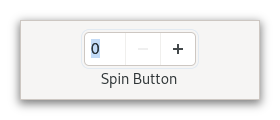

# Gtk.SpinButton

**Bibliothèque :** GTK4  
**Import :** `import Gtk from 'gi:Gtk-4.0'`



## Description

Contrôle numérique incrémental.

Cette page documente l'utilisation TypeScript avec node-gtk. Les types et les surcharges exactes sont générés depuis le typelib installé ; vérifiez toujours `node_modules/.node-gtk-types` pour votre version.

## Import et exemple minimal

```ts
import Gtk from 'gi:Gtk-4.0'
import Gio from 'gi:Gio-2.0'

const spin = Gtk.SpinButton.newWithRange(0, 100, 1)
spin.setValue(42)
```

## API principale

```ts
SpinButton.newWithRange(min: number, max: number, step: number); setValue(value: number); getValue(): number; setRange(min: number, max: number)
```

### Propriétés

- `value`
- `adjustment`
- `digits`
- `numeric`
- `wrap`

### Signaux

- `value-changed`
- `input`
- `output`

## Types associés

- `Gtk.Widget` et les classes parentes pour les widgets GTK.
- `Gio.ListModel`, `Gio.MenuModel` ou `Gio.Action` selon l'API.
- Les énumérations sont accessibles via l'espace de noms, par exemple `Gtk.Orientation.VERTICAL` lorsque l'API le demande.

## Bonnes pratiques

- Utilisez les propriétés camelCase et les méthodes `get`/ `set` exposées par node-gtk.
- Connectez les signaux avec `on('nom-du-signal', callback)`.
- Ne conservez pas un contexte Cairo reçu dans un callback de dessin.
- Vérifiez la nullabilité et les signatures dans les déclarations générées.

## Références

- [Documentation GTK4](https://docs.gtk.org/gtk4/)
- [Documentation Libadwaita](https://gnome.pages.gitlab.gnome.org/libadwaita/doc/1-latest/)
- [Guide API et exemples TypeScript](../typescript-gtk4-adwaita-cairo-api-examples.md)
